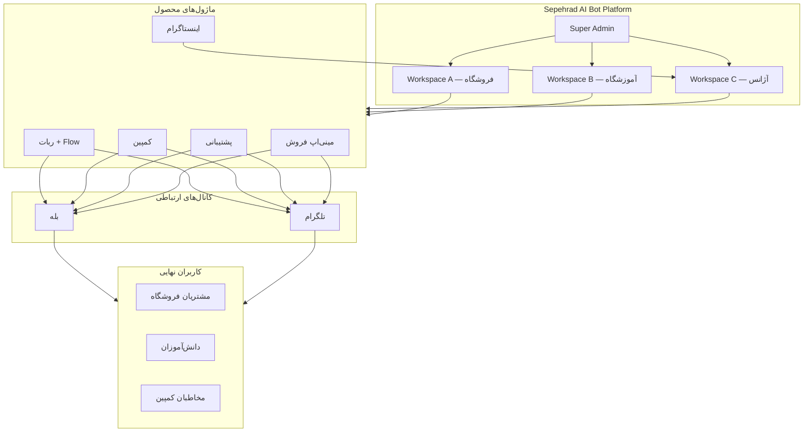

# Sepehrad AI Bot — طرح کسب‌وکار و معرفی محصول

> **نوع سند:** بیزینس‌پلن / معرفی محصول  
> **مخاطب:** بنیان‌گذار، سرمایه‌گذار، شریک تجاری، تیم فروش  
> **تاریخ:** ۱۴۰۴/۰۴/۰۴  
> **نسخه:** ۱.۰

---

## فهرست مطالب

1. [خلاصه مدیریتی](#۱-خلاصه-مدیریتی)
2. [بیان مسأله](#۲-بیان-مسأله)
3. [راه‌حل: Sepehrad AI Bot چیست؟](#۳-راه‌حل-sepehrad-ai-bot-چیست)
4. [بازار هدف و مشتریان](#۴-بازار-هدف-و-مشتریان)
5. [ارزش پیشنهادی](#۵-ارزش-پیشنهادی)
6. [محصولات و ماژول‌ها](#۶-محصولات-و-ماژول‌ها)
7. [گردش کار مشتری (Customer Journey)](#۷-گردش-کار-مشتری-customer-journey)
8. [مدل کسب‌وکار](#۸-مدل-کسب‌وکار)
9. [مزیت رقابتی](#۹-مزیت-رقابتی)
10. [معماری کسب‌وکار در یک نگاه](#۱۰-معماری-کسب‌وکار-در-یک-نگاه)
11. [شاخص‌های کلیدی عملکرد (KPI)](#۱۱-شاخص‌های-کلیدی-عملکرد-kpi)
12. [ریسک‌ها و محدودیت‌ها](#۱۲-ریسک‌ها-و-محدودیت‌ها)
13. [چشم‌انداز و نقشه راه](#۱۳-چشم‌انداز-و-نقشه-راه)
14. [جمع‌بندی](#۱۴-جمع‌بندی)

---

## ۱. خلاصه مدیریتی

**Sepehrad AI Bot** یک **پلتفرم SaaS چندمستاجری** برای مدیریت ربات‌های پیام‌رسان در **بله (Bale)** و **تلگرام (Telegram)** است. این محصول به کسب‌وکارها، برندها، آموزشگاه‌ها و فروشگاه‌های آنلاین ایرانی کمک می‌کند تا بدون نیاز به تیم فنی، یک اکوسystem کامل ارتباط با مشتری، بازاریابی و فروش را داخل پیام‌رسان‌های محبوب راه‌اندازی کنند.

### آنچه محصول انجام می‌دهد — در یک جمله

> «یک پنل فارسی یکپارچه برای ساخت ربات، جذب مخاطب، ارسال کمپین، پشتیبانی مشتری و فروش آنلاین — همگی از داخل بله و تلگرام.»

### اجزای اصلی محصول

| ماژول | کاربرد تجاری |
|-------|--------------|
| **پنل مدیریت ربات** | تنظیم، مانیتورینگ و کنترل ربات از یک داشبورد فارسی |
| **سازنده منوی /start** | ساخت منوی تعاملی بدون کدنویسی |
| **کمپین‌های انبوه** | بازاریابی هدفمند به مخاطبان ثبت‌شده |
| **پشتیبانی دوطرفه** | تیکت‌گذاری و پاسخ‌گویی مستقیم به کاربران |
| **مینی‌اپ فروشگاه** | فروشگاه آنلاین داخل WebApp بله/تلگرام |
| **استخراج شماره اینستاگرام** | جمع‌آوری لید از بکاپ JSON اینستاگرام |

### نکته مهم درباره نام محصول

با وجود نام «AI Bot»، در نسخه فعلی محصول **هیچ یکپارچه‌سازی با مدل‌های زبانی (LLM)** مانند ChatGPT وجود ندارد. نام برند به چشم‌انداز آینده (اتوماسیون هوشمند پاسخ‌گویی و شخصی‌سازی) اشاره دارد؛ محصول فعلی یک **پلتفرم اتوماسیون و CRM پیام‌رسانی** است.

---

## ۲. بیان مسأله

### چالش‌هایی که کسب‌وکارهای ایرانی با آن روبه‌رو هستند

**۱. پراکندگی ابزارها**  
بسیاری از کسب‌وکارها برای ربات، کمپین، پشتیبانی و فروش از ابزارهای جداگانه استفاده می‌کنند — یا حتی همه‌چیز را دستی انجام می‌دهند. این یعنی هزینه بالا، خطای انسانی و از دست رفتن فرصت فروش.

**۲. وابستگی به تلگرام در بازار ایران**  
تلگرام همچنان کانال اصلی ارتباط است، اما **بله** به‌عنوان پیام‌رسان داخلی رشد کرده و کسب‌وکارها نیاز دارند هر دو پلتفرم را پوشش دهند — بدون دو بار راه‌اندازی.

**۳. نبود فروشگاه بومی داخل پیام‌رسان**  
بسیاری از فروشگاه‌ها لینک خارجی (سایت، اینستاگرام) می‌فرستند؛ کاربر از محیط پیام‌رسان خارج می‌شود و نرخ تبدیل پایین می‌آید. مینی‌اپ (WebApp) این شکاف را پر می‌کند.

**۴. دشواری جمع‌آوری و سگمنت‌بندی مخاطب**  
بدون ثبت شماره تماس، برچسب‌گذاری و تاریخچه تعامل، ارسال پیام هدفمند غیرممکن است. ابزارهای عمومی این قابلیت را به‌صورت بومی و فارسی ارائه نمی‌دهند.

**۵. لیدگیری از اینستاگرام**  
فروشندگان B2C و B2B (املاک، زیبایی، آموزش و …) شماره تماس مشتریان را در دایرکت اینستاگرام دارند، اما استخراج و سازماندهی آن‌ها زمان‌بر و پرخطاست.

### فرصت بازار

- رشد استفاده از **ربات‌های کسب‌وکار** در بله و تلگرام
- پذیرش **مینی‌اپ** به‌عنوان کانال فروش
- نیاز به **راه‌حل فارسی، RTL و بومی** (تاریخ شمسی، زرین‌پال، شماره موبایل ۰۹…)
- تقاضا برای **پلتفرم چندمستاجری** که چند مشتری/برند را از یک زیرساخت سرویس دهد

---

## ۳. راه‌حل: Sepehrad AI Bot چیست؟

Sepehrad AI Bot یک **پلتفرم B2B** است که به هر مشتری (tenant) یک **فضای کاری (Workspace)** اختصاصی می‌دهد. در این فضا، صاحب کسب‌وکار می‌تواند:

1. ربات بله و/یا تلگرام را متصل و فعال کند
2. منوی خوش‌آمدگویی (/start) را با سازنده بصری طراحی کند
3. مخاطبان را جذب، برچسب‌گذاری و سگمنت کند
4. کمپین‌های بازاریابی زمان‌بندی‌شده ارسال کند
5. به پیام‌های پشتیبانی کاربران پاسخ دهد
6. (اختیاری) فروشگاه مینی‌اپ راه بیندازد و سفارش بگیرد
7. (اختیاری) شماره تماس از بکاپ اینستاگرام استخراج کند

### تعریف محصول

| بعد | توضیح |
|-----|-------|
| **نوع محصول** | پلتفرم SaaS / Bot Management + Mini-Commerce + Lead Tools |
| **پلتفرم‌های پشتیبانی‌شده** | بله، تلگرام |
| **زبان رابط** | فارسی (RTL) |
| **مدل استقرار** | Cloud (مثلاً Runflare) — Django + PostgreSQL |
| **مدل دسترسی** | چندمستاجری — هر Workspace مستقل |

---

## ۴. بازار هدف و مشتریان

### بخش‌بندی مشتریان (Customer Segments)

#### الف) کسب‌وکارهای کوچک و متوسط (SMB)

- فروشگاه‌های آنلاین (پوشاک، لوازم خانگی، مواد غذایی)
- آموزشگاه‌ها و مؤسسات آموزشی
- سالن‌های زیبایی، کلینیک‌ها، مشاوران
- فریلنسرها و برندهای شخصی

**نیاز:** ربات ساده + فروش + پشتیبانی + کمپین تخفیف

#### ب) برندها و آژانس‌های دیجیتال مارکتینگ

- آژانس‌هایی که برای چند مشتری ربات مدیریت می‌کنند
- برندهای B2C با کمپین‌های فصلی

**نیاز:** چند Workspace، سگمنت‌بندی، کمپین انبوه، آمار

#### ج) کسب‌وکارهای لیدمحور (Lead Generation)

- مشاوران املاک
- فروشندگان B2B
- صاحبان پیج اینستاگرام پرمخاطب

**نیاز:** استخراج شماره، برچسب‌گذاری، پیگیری

#### د) سازمان‌ها و نهادهای عمومی/نیمه‌عمومی

- کانال‌های اطلاع‌رسانی
- پشتیبانی شهروندی

**نیاز:** منوی ساختاریافته، پشتیبانی تیکتی، بدون فروش

### پرسونای کاربر

| نقش | کاربر | هدف اصلی |
|-----|-------|----------|
| **مدیر کسب‌وکار** | صاحب فروشگاه/آموزشگاه | فروش بیشتر، کاهش تماس تلفنی |
| **اپراتور پشتیبانی** | کارمند پاسخ‌گویی | پاسخ سریع به کاربران ربات |
| **مارکeter** | مسئول کمپین | ارسال پیام هدفمند، افزایش engagement |
| **Super Admin** | مالک پلتفرم | مدیریت Workspaceها و دسترسی‌ها |

---

## ۵. ارزش پیشنهادی

### برای صاحب کسب‌وکار

| ارزش | توضیح |
|------|-------|
| **صرفه‌جویی در زمان** | راه‌اندازی ربات و منو بدون برنامه‌نویس |
| **افزایش فروش** | فروشگاه داخل پیام‌رسان + پرداخت زرین‌پال |
| **حفظ مشتری** | کمپین‌های هدفمند و پشتیبانی مستقیم |
| **داده یکپارچه** | تاریخچه تعامل، برچسب‌ها، آمار کمپین در یک پنل |
| **بومی‌سازی** | فارسی، شمسی، ریال، شماره ۰۹، درگاه ایرانی |

### برای کاربر نهایی (مشتری ربات)

| ارزش | توضیح |
|------|-------|
| **دسترسی آسان** | تعامل در همان اپ پیام‌رسان |
| **خرید سریع** | مینی‌اپ بدون خروج از بله/تلگرام |
| **پشتیبانی مستقیم** | ارسال پیام به پشتیبانی از داخل ربات |
| **محتوای غنی** | منوی چندرسانه‌ای (متن، عکس، ویدیو، فایل) |

### برای مالک پلتفرم (شما)

| ارزش | توضیح |
|------|-------|
| **مقیاس‌پذیری** | یک زیرساخت، چندین مشتری (Multi-Tenant) |
| **ماژولار بودن** | فعال/غیرفعال کردن قابلیت‌ها per Workspace |
| **توسعه تدریجی** | افزودن AI، پلتفرم جدید، یا ماژول CRM |

---

## ۶. محصولات و ماژول‌ها

### ۶.۱. پنل مدیریت ربات (Core Platform)

**چیست؟** داشبورد وب فارسی که مرکز کنترل تمام فعالیت‌هاست.

**قابلیت‌های کلیدی:**
- ورود امن با حساب staff
- سوئیچ بین پلتفرم بله و تلگرام
- داشبورد آماری (مشترکین، کمپین‌ها، پیام‌ها)
- تنظیمات ربات (توکن، webhook، پیام‌ها، برندینگ پنل)
- مدیریت لیست مشترکین با فیلتر برچسب
- مشاهده و پاسخ به پیام‌های ورودی

**ارزش تجاری:** یک نقطه کنترل واحد به‌جای چند ابزار پراکنده.

---

### ۶.۲. سازنده منوی /start (Flow Builder)

**چیست؟** ابزار بصری برای طراحی منوی تعاملی ربات هنگام `/start`.

**قابلیت‌های کلیدی:**
- ساخت منوی چندسطحی با دکمه‌های inline
- ترکیب متن، تصویر، ویدیو، صدا و فایل
- برچسب‌گذاری خودکار مخاطب بر اساس کلیک (Tag Assignment)
- ثبت تاریخچه کلیک کاربر (Flow Log)
- دکمه پشتیبانی inline
- جمع‌آوری شماره تماس در شروع (Share Contact)

**سناریوی استفاده:**
> یک آموزشگاه منویی می‌سازد: «دوره‌های ما»، «ثبت‌نام»، «تماس با ما». هر کلیک، برچسب مناسب به کاربر اضافه می‌کند تا بعداً کمپین «دوره پاییز» فقط به علاقه‌مندان ارسال شود.

---

### ۶.۳. سیستم کمپین و بازاریابی انبوه

**چیست؟** ابزار ارسال پیام/رسانه به مخاطبان هدف.

**قابلیت‌های کلیدی:**
- انواع محتوا: متن، متن+دکمه، عکس، ویدیو، صدا، فایل
- `inline_keyboard` سفارشی
- هدف‌گیری بر اساس برچسب (Tag) یا کل مخاطبان
- ارسال فوری یا زمان‌بندی‌شده (تاریخ شمسی در پنل)
- Snapshot مخاطبان در لحظه صف‌بندی (ثبات کمپین)
- آمار delivery (موفق/ناموفق)
- Retry خودکار برای ارسال‌های ناموفق

**سناریوی استفاده:**
> فروشگاه پوشاک در آخر هفته کمپین «تخفیف ۳۰٪» را فقط به برچسب «خریدار قبلی» ارسال می‌کند.

---

### ۶.۴. سیستم پشتیبانی (Support Ticketing)

**چیست؟** ارتباط دوطرفه بین کاربر ربات و اپراتور پنل.

**قابلیت‌های کلیدی:**
- دکمه «پیام به پشتیبانی» در ربات
- Thread کامل مکالمه در پروفایل مشترک
- پاسخ متنی و رسانه‌ای از پنل
- ارسال پیام شخصی به هر مشترک
- علامت‌گذاری پیام‌های خوانده‌شده

**سناریوی استفاده:**
> مشتری از ربات سؤال می‌پرسد؛ اپراتور از پنل پاسخ می‌دهد؛ پاسخ مستقیماً در چت بله/تلگرام کاربر ظاهر می‌شود.

---

### ۶.۵. مینی‌اپ فروشگاه (Catalog Mini-App)

**چیست؟** فروشگاه React که داخل WebApp بله/تلگرام باز می‌شود.

**قابلیت‌های کلیدی:**

| بخش | جزئیات |
|-----|--------|
| **کاتالوگ** | دسته‌بندی سلسله‌مراتبی، محصول/خدمت/نمونه‌کار/دانلود |
| **فروش** | خرید، درخواست قیمت، دانلود رایگان/پولی |
| **سبد خرید** | مدیریت سبد per کاربر |
| **پرداخت** | زرین‌پال (آنلاین) یا ارسال سبد به ادمین (دستی) |
| **گیت کانال** | الزام عضویت در کانال قبل از دسترسی |
| **تم‌سازی** | رنگ، فونت، لوگو، برچسب‌های UI |
| **احراز هویت** | اعتبارسنجی initData از WebApp SDK |

**صفحات فروشگاه:**
- صفحه اصلی (دسته‌ها، جستجو، محصولات ویژه)
- صفحه دسته‌بندی
- صفحه جزئیات محصول (گالری، خرید)
- سبد خرید و تسویه‌حساب

**سناریوی استفاده:**
> کاربر روی دکمه «فروشگاه» در ربات کلیک می‌کند؛ مینی‌اپ باز می‌شود؛ محصول را به سبد اضافه می‌کند؛ با زرین‌پال پرداخت می‌کند؛ سفارش در پنل ثبت می‌شود.

---

### ۶.۶. ماژول اینستاگرام (استخراج شماره)

**چیست؟** ابزار استخراج شماره موبایل ایرانی از فایل JSON بکاپ اینستاگرام.

**قابلیت‌های کلیدی:**
- پردازش **در مرورگر کاربر** (client-side) — فایل خام به سرور ارسال نمی‌شود
- شناسایی شماره‌های `09xxxxxxxxx`
- دسته‌بندی بر اساس «حوزه فعالیت» (املاک، زیبایی، …)
- تاریخچه عملیات استخراج
- خروجی Excel
- راهنمای تصویری بکاپ‌گیری از اینستاگرام

**سناریوی استفاده:**
> مشاور املاک بکاپ JSON اینستاگرام را آپلود می‌کند؛ شماره‌های یافت‌شده در پایگاه داده ذخیره و برای کمپین SMS یا تماس استفاده می‌شوند.

---

### ۶.۷. مدیریت مخاطبین (CRM سبک)

**چیست؟** پایگاه داده مشترکین ربات با قابلیت سگمنت‌بندی.

**داده‌های هر مشترک:**
- شناسه پیام‌رسان و chat_id
- شماره تماس (در صورت ثبت)
- وضعیت ثبت‌نام و فعال/غیرفعال
- برچسب‌ها (Tags)
- تاریخچه کلیک منو
- پاسخ‌های نام‌دار از flow
- اولین بازدید مینی‌اپ
- پیام‌های ورودی و تیکت پشتیبانی

**ارزش تجاری:** پایه تمام کمپین‌ها و تحلیل رفتار مشتری.

---

## ۷. گردش کار مشتری (Customer Journey)

### ۷.۱. مسیر راه‌اندازی (Onboarding)

```
ثبت‌نام در پلتفرم
    ↓
ایجاد Workspace + دسترسی به ماژول‌ها
    ↓
اتصال Bot Token (بله/تلگرام)
    ↓
ثبت Webhook
    ↓
طراحی منوی /start
    ↓
(اختیاری) راه‌اندازی مینی‌اپ فروشگاه
    ↓
(اختیاری) فعال‌سازی ماژول اینستاگرام
    ↓
انتشار لینک/ربات به مخاطبان
```

### ۷.۲. مسیر کاربر نهایی (End User)

```
/start در ربات
    ↓
(در صورت نیاز) اشتراک شماره تماس
    ↓
مشاهده منوی تعاملی
    ↓
    ├── کلیک روی گزینه‌ها → دریافت محتوا
    ├── پیام به پشتیبانی → تیکت
    ├── باز کردن مینی‌اپ → خرید
    └── /stop → لغو اشتراک
```

### ۷.۳. مسیر کمپین

```
تعریف کمپین در پنل
    ↓
انتخاب مخاطب (برچسب / همه)
    ↓
صف‌بندی (فوری یا زمان‌بندی)
    ↓
ارسال خودکار (cron)
    ↓
مشاهده آمار delivery
```

---

## ۸. مدل کسب‌وکار

> **توجه:** مدل درآمدی در کدبیس پیاده‌سازی نشده؛ بخش زیر پیشنهاد استراتژیک بر اساس ساختار محصول است.

### ۸.۱. مدل درآمدی پیشنهادی

| مدل | توضیح |
|-----|-------|
| **اشتراک ماهانه/سالانه** | دسترسی به پنل + تعداد مشترک / کمپین |
| **Freemium** | ربات پایه رایگان؛ کمپین و مینی‌اپ پولی |
| **Per-Module** | فعال‌سازی جداگانه مینی‌اپ، اینستاگرام، … |
| **Per-Workspace** | قیمت‌گذاری برای آژانس‌ها با چند مشتری |
| **Setup Fee** | هزینه راه‌اندازی اولیه برای SMB |

### ۸.۲. ساختار هزینه (Cost Structure)

| هزینه | توضیح |
|-------|-------|
| **زیرساخت** | سرور (Django + PostgreSQL + Media Storage) |
| **API پیام‌رسان** | رایگان (Bot API) |
| **درگاه پرداخت** | کارمزد زرین‌پال (بر عهده فروشنده) |
| **توسعه و نگهداری** | تیم فنی |
| **پشتیبانی مشتری** | onboarding و ticket |

### ۸.۳. کانال‌های فروش پیشنهادی

- فروش مستقیم B2B (تماس، دمو)
- همکاری با آژانس‌های دیجیتال مارکتینگ
- معرفی از طریق کانال‌های بله/تلگرام
- محتوای آموزشی (راه‌اندازی ربات، مینی‌اپ)

---

## ۹. مزیت رقابتی

### ۹.۱. تمایزهای کلیدی

| مزیت | توضیح |
|------|-------|
| **دو پلتفرم، یک پنل** | بله + تلگرام با سوئیچ ساده |
| **فارسی بومی** | RTL، تاریخ شمسی، UX بومی |
| **All-in-One** | ربات + CRM + کمپین + فروش + لید — در یک محصول |
| **مینی‌اپ فروشگاه** | فروش درون پیام‌رسان با زرین‌پال |
| **سازنده Flow بصری** | بدون کد، منوی پیچیده |
| **Multi-Tenant** | مقیاس برای SaaS و آژانس‌ها |
| **حریم خصوصی اینستاگرام** | استخراج client-side |

### ۹.۲. مقایسه با جایگزین‌ها

| جایگزین | محدودیت | Sepehrad |
|---------|---------|----------|
| ربات DIY (BotFather + کد) | نیاز به توسعه‌دهنده | No-code flow builder |
| ابزارهای خارجی (ManyChat, …) | فارسی/بله/زرین‌پال ضعیف | بومی‌سازی کامل |
| فروشگاه جدا (WooCommerce) | خروج از پیام‌رسان | مینی‌اپ درون‌اپ |
| CRM جدا | بدون اتصال به ربات | CRM یکپارچه با ربات |
| استخراج دستی اینستا | کند و خطاپذیر | ابزار خودکار |

---

## ۱۰. معماری کسب‌وکار در یک نگاه



### جریان ارزش (Value Flow)

```
مالک پلتفرم
    → ارائه Workspace + ماژول‌ها
        → کسب‌وکار (مشتری B2B)
            → ربات + کمپین + فروش
                → کاربر نهایی (تعامل + خرید)
                    → درآمد کسب‌وکار
                        → اشتراک/تمدید Sepehrad
```

---

## ۱۱. شاخص‌های کلیدی عملکرد (KPI)

### KPIهای پلتفرم (برای مالک محصول)

| شاخص | تعریف |
|------|-------|
| **MRR** | درآمد تکرارشونده ماهانه |
| **Active Workspaces** | Workspaceهای فعال |
| **Churn Rate** | نرخ ترک مشتری |
| **Module Adoption** | درصد استفاده از مینی‌اپ / اینستا / کمپین |

### KPIهای مشتری (در پنل موجود)

| شاخص | منبع داده |
|------|-----------|
| **تعداد مشترکین** | مدل Subscriber |
| **نرخ ثبت‌نام (Share Contact)** | is_registered |
| **نرخ engagement کمپین** | CampaignDelivery (sent/failed) |
| **کلیک دکمه کمپین** | CallbackLog |
| **سفارشات فروشگاه** | CatalogOrder |
| **تیکت‌های پشتیبانی** | SupportTicketMessage |
| **شماره‌های استخراج‌شده** | ExtractedPhone |

---

## ۱۲. ریسک‌ها و محدودیت‌ها

### ریسک‌های فنی

| ریسک | تأثیر | راهکار |
|------|-------|--------|
| تغییر API بله/تلگرام | قطع سرویس | abstraction layer (messenger_api) |
| محدودیت rate limit | تأخیر کمپین | delay بین ارسال‌ها |
| وابستگی cron | از دست رفتن job | monitoring + retry |

### ریسک‌های تجاری

| ریسک | تأثیر | راهکار |
|------|-------|--------|
| رقابت ابزارهای رایگان | فشار قیمت | تمایز all-in-one + پشتیبانی |
| حساسیت استخراج اینستا | اعتماد/قانونی | client-side + شفافیت |
| نام «AI» بدون AI | انتظار نادرست | شفاف‌سازی + roadmap AI |

### محدودیت‌های فعلی محصول

- **بدون Celery/Redis** — صف پس‌زمینه با cron
- **بدون AI/Chatbot** — پاسخ خودکار محدود به flow از پیش تعریف‌شده
- **ذخیره فایل محلی** — نیاز به S3 برای scale بالا
- **یک owner per Workspace** — بدون تیم چندنفره داخل Workspace

---

## ۱۳. چشم‌انداز و نقشه راه

### فاز ۱ — محصول فعلی (MVP+)

- [x] ربات بله + تلگرام
- [x] Flow Builder
- [x] کمپین انبوه
- [x] پشتیبانی تیکتی
- [x] مینی‌اپ فروشگاه + زرین‌پال
- [x] استخراج شماره اینستاگرام
- [x] Multi-Tenant Workspace

### فاز ۲ — رشد (پیشنهادی)

- [ ] یکپارچه‌سازی AI برای پاسخ خودکار پشتیبانی
- [ ] داشبورد تحلیلی پیشرفته (funnel، conversion)
- [ ] تیم چندنفره per Workspace
- [ ] API عمومی برای integratorها
- [ ] اتصال SMS برای کمپین خارج از ربات
- [ ] billing و subscription خودکار

### فاز ۳ — مقیاس (پیشنهادی)

- [ ] marketplace قالب Flow و فروشگاه
- [ ] white-label برای آژانس‌ها
- [ ] پشتیبانی از پیام‌رسان‌های بیشتر
- [ ] automation rules (if/then)
- [ ] A/B testing کمپین

### چشم‌انداز بلندمدت

تبدیل Sepehrad AI Bot به **«سیستم عامل ارتباط با مشتری ایرانی»** — جایی که هر کسب‌وکار کوچک بتواند در ۳۰ دقیقه ربات، فروشگاه، CRM و بازاریابی خود را در پیام‌رسان‌های بومی راه بیندازد — با لایه هوش مصنوعی برای شخصی‌سازی و اتوماسیون.

---

## ۱۴. جمع‌بندی

**Sepehrad AI Bot** پاسخی به نیاز واقعی کسب‌وکارهای ایرانی است که می‌خواهند در **بله و تلگرام** حضور حرفه‌ای داشته باشند: نه فقط یک ربات ساده، بلکه یک **اکوسystem کامل** شامل جذب مخاطب، بازاریابی، پشتیبانی، فروش آنلاین و لیدگیری.

### نقاط قوت محصول

1. **یکپارچگی** — همه‌چیز در یک پنل فارسی
2. **بومی‌سازی** — مناسب بازار ایران
3. **مقیاس‌پذیری SaaS** — Multi-Tenant از ابتدا
4. **فروش درون پیام‌رسان** — مینی‌اپ با پرداخت واقعی
5. **انعطاف ماژولار** — هر Workspace فقط آنچه نیاز دارد

### مخاطب ایده‌آل

کسب‌وکارهایی که:
- مخاطبشان در بله/تلگرام است
- به فروش یا لیدگیری آنلاین نیاز دارند
- تیم فنی ندارند یا نمی‌خواهند هزینه توسعه سفارشی بدهند
- به راه‌حل فارسی و بومی اهمیت می‌دهند

---

## پیوست: ارتباط با مستندات فنی

برای جزئیات پیاده‌سازی، API، مدل دیتابیس و تنظیمات deployment به سند زیر مراجعه کنید:

📄 **[PROJECT_DOCUMENTATION_FA.md](./PROJECT_DOCUMENTATION_FA.md)** — مستندات فنی کامل پروژه

---

*این سند بر اساس وضعیت فعلی کدبیس (Django 6 + PostgreSQL + React Mini-App) تهیه شده است.*
