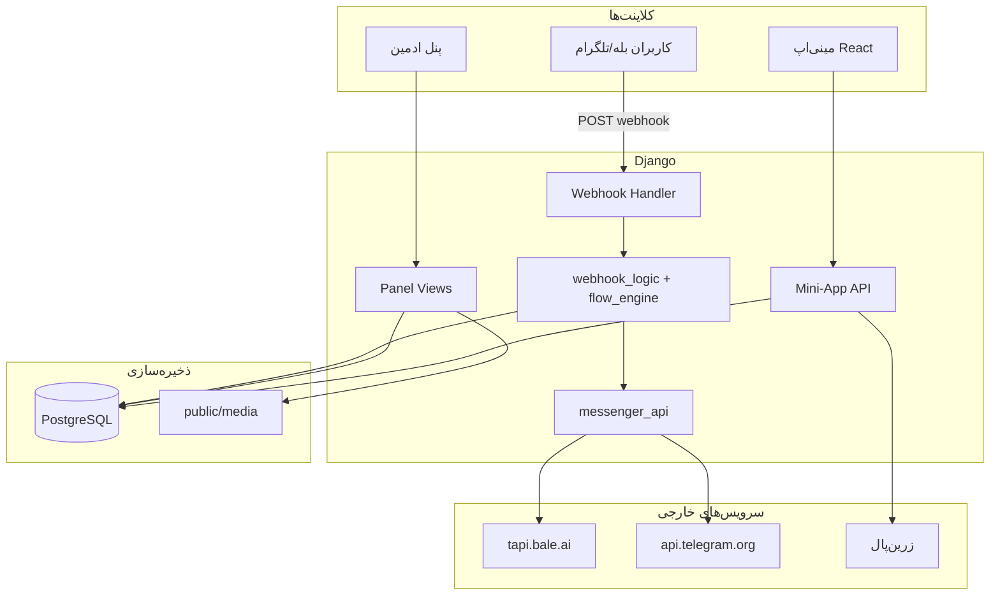

# مستندات کامل پروژه Sepehrad AI Bot (Core)

> **نسخه مستند:** بر اساس وضعیت فعلی کدبیس  
> **تاریخ:** ۱۴۰۴/۰۳/۲۶  
> **زبان رابط:** فارسی (RTL)  
> **فریم‌ورک:** Django 6 + PostgreSQL + React (Mini-App)

---

## فهرست مطالب

1. [معرفی کلی](#۱-معرفی-کلی)
2. [معماری و ساختار پروژه](#۲-معماری-و-ساختار-پروژه)
3. [تکنولوژی‌ها و وابستگی‌ها](#۳-تکنولوژی‌ها-و-وابستگی‌ها)
4. [چندمستاجری (Multi-Tenant)](#۴-چندمستاجری-multi-tenant)
5. [ماژول بازو (balebot)](#۵-ماژول-بازو-balebot)
6. [موتور جریان /start (Flow Engine)](#۶-موتور-جریان-start-flow-engine)
7. [سیستم کمپین و ارسال انبوه](#۷-سیستم-کمپین-و-ارسال-انبوه)
8. [سیستم پشتیبانی](#۸-سیستم-پشتیبانی)
9. [مینی‌اپ فروشگاه (Catalog Mini-App)](#۹-مینی‌اپ-فروشگاه-catalog-mini-app)
10. [ماژول اینستاگرام (استخراج شماره)](#۱۰-ماژول-اینستاگرام-استخراج-شماره)
11. [پنل مدیریت (Staff Panel)](#۱۱-پنل-مدیریت-staff-panel)
12. [APIها و مسیرهای HTTP](#۱۲-apiها-و-مسیرهای-http)
13. [مدل‌های دیتابیس](#۱۳-مدل‌های-دیتابیس)
14. [سرویس‌ها و لایه منطق](#۱۴-سرویس‌ها-و-لایه-منطق)
15. [دستورات مدیریتی (Management Commands)](#۱۵-دستورات-مدیریتی-management-commands)
16. [تنظیمات و متغیرهای محیطی](#۱۶-تنظیمات-و-متغیرهای-محیطی)
17. [یکپارچه‌سازی‌های خارجی](#۱۷-یکپارچه‌سازی‌های-خارجی)
18. [استقرار و اجرا در Production](#۱۸-استقرار-و-اجرای-production)
19. [نکات امنیتی](#۱۹-نکات-امنیتی)
20. [محدودیت‌ها و کدهای Legacy](#۲۰-محدودیت‌ها-و-کدهای-legacy)

---

## ۱. معرفی کلی

این پروژه یک **پلتفرم چندمستاجری مدیریت ربات پیام‌رسان** است که از **بله (Bale)** و **تلگرام (Telegram)** پشتیبانی می‌کند. علاوه بر ربات، شامل این بخش‌هاست:

| بخش | توضیح |
|-----|-------|
| **پنل وب مدیریت** | داشبورد فارسی RTL برای ادمین‌ها |
| **موتور جریان /start** | سازنده بصری منوی تعاملی ربات |
| **کمپین‌های انبوه** | ارسال پیام/رسانه به مخاطبان هدف |
| **پشتیبانی دوطرفه** | تیکت بین کاربر و ادمین در پنل |
| **مینی‌اپ فروشگاه** | فروشگاه React داخل WebApp بله/تلگرام |
| **ماژول اینستاگرام** | استخراج شماره موبایل از بکاپ JSON |

> **توجه:** با وجود نام پروژه، **هیچ یکپارچه‌سازی AI/LLM** (مثل ChatGPT) در کدبیس فعلی وجود ندارد.

---

## ۲. معماری و ساختار پروژه

```
core/
├── core/                    # تنظیمات Django (settings, urls, wsgi)
├── balebot/                 # اپ اصلی: ربات، پنل، فروشگاه، وب‌هوک
│   ├── models.py            # تمام مدل‌های دیتابیس
│   ├── views_webhook.py     # دریافت آپدیت از بله/تلگرام
│   ├── views_panel.py       # پنل: داشبورد، مشترکین، کمپین
│   ├── views_panel_catalog.py
│   ├── views_panel_users.py
│   ├── views_miniapp_api.py # REST API مینی‌اپ
│   ├── views_miniapp_serve.py
│   ├── services/            # منطق تجاری
│   ├── management/commands/ # cron jobs
│   ├── templates/           # قالب‌های HTML پنل
│   └── static/              # CSS/JS پنل
├── instagram/               # اپ استخراج شماره از بکاپ اینستا
├── miniapp/                 # SPA فروشگاه (React + Vite + Tailwind)
├── static/                  # فایل‌های استاتیک جمع‌آوری‌شده
├── public/                  # STATIC_ROOT و MEDIA_ROOT
├── docs/                    # مستندات
├── manage.py
└── requirements.txt
```

### دیاگرام جریان داده



---

## ۳. تکنولوژی‌ها و وابستگی‌ها

### Backend (Python)

| پکیج | کاربرد |
|------|--------|
| Django 6 | فریم‌ورک وب |
| psycopg | اتصال PostgreSQL |
| requests | فراخوانی Bot API |
| python-decouple / python-dotenv | خواندن `.env` |
| jdatetime | تاریخ شمسی در پنل |
| Pillow | پردازش تصویر |
| openpyxl | خروجی Excel (اینستاگرام) |

### Frontend (Mini-App)

| پکیج | کاربرد |
|------|--------|
| React 19 | UI |
| Vite 6 | Build tool |
| TypeScript | Type safety |
| Tailwind CSS 3 | استایل |
| React Router | مسیریابی SPA |

### زیرساخت

- **دیتابیس:** PostgreSQL
- **صف پس‌زمینه:** cron + management commands (بدون Celery/Redis)
- **فایل‌ها:** ذخیره محلی در `public/media/`

---

## ۴. چندمستاجری (Multi-Tenant)

هر **Workspace** یک فضای کاری مستقل است که به یک کاربر Django (`owner`) متصل است.

### پرچم‌های دسترسی Workspace

| فیلد | معنی |
|------|------|
| `allow_bale` | دسترسی به ربات بله |
| `allow_telegram` | دسترسی به ربات تلگرام |
| `allow_bale_miniapp` | مینی‌اپ فروشگاه در بله |
| `allow_telegram_miniapp` | مینی‌اپ فروشگاه در تلگرام |
| `allow_instagram` | ماژول استخراج شماره اینستا |

### جداسازی داده

تمام موجودیت‌ها (مشترکین، کمپین‌ها، تنظیمات، فروشگاه، …) با دو فیلد محدود می‌شوند:

- `workspace` — فضای کاری
- `platform` — `bale` یا `telegram`

### سوئیچ پلتفرم

ادمین در پنل می‌تواند بین بله و تلگرام جابه‌جا شود (`/switch-platform/`). پلتفرم فعال در **session** ذخیره می‌شود و تمام لیست‌ها/فرم‌ها بر اساس آن فیلتر می‌شوند.

---

## ۵. ماژول بازو (balebot)

قلب پروژه. تمام تعامل با کاربران ربات از اینجا عبور می‌کند.

### ۵.۱. دریافت Webhook

**فایل:** `balebot/views_webhook.py`

| مسیر | توضیح |
|------|-------|
| `POST /webhook/<platform>/<secret>/` | مسیر اصلی (bale یا telegram) |
| `POST /webhook/<secret>/` | سازگاری با نسخه قدیمی (فقط بله) |
| `GET /health/` | بررسی سلامت — پاسخ `ok` |

**فرآیند:**

1. secret با `BotSettings.webhook_secret` مقایسه می‌شود
2. اگر `is_enabled=False` باشد، پاسخ داده نمی‌شود
3. payload JSON پارس می‌شود
4. اگر `message` داشت → `handle_message()`
5. اگر `callback_query` داشت → `handle_callback()`

### ۵.۲. دستورات ربات

**فایل:** `balebot/services/webhook_logic.py`

| دستور / رویداد | رفتار |
|----------------|-------|
| `/start` | اگر جمع‌آوری شماره فعال و کاربر ثبت‌نام نکرده → کیبورد تماس؛ وگرنه → رندر جریان /start |
| `/help` | ارسال `help_message` (اگر `enable_help_command=True`) |
| `/stop` | `is_active=False`، پیام لغو اشتراک، حذف کیبورد |
| دکمه پشتیبانی | `awaiting_support_message=True` + پیام راهنما |
| پیام بعد از پشتیبانی | ذخیره در `SupportTicketMessage` + تأیید |
| اشتراک‌گذاری تماس | ثبت شماره، `is_registered=True`، پیام موفقیت، رندر flow |
| `web_app_data` | پردازش درخواست/سبد از مینی‌اپ |
| سایر پیام‌ها | ذخیره در `InboundMessage` |

### ۵.۳. Callback (دکمه‌های Inline)

| پیشوند callback | handler |
|-----------------|---------|
| `f…` | کلیک دکمه در flow engine |
| `fb…` | دکمه «بازگشت» در flow |
| `bsup` | دکمه پشتیبانی inline |
| `c{campaign_id}_{row}_{col}` | کلیک دکمه کمپین — ثبت در `CallbackLog` |

### ۵.۴. مشترکین (Subscribers)

هر کاربری که با ربات تعامل دارد یک رکورد `Subscriber` دارد:

| فیلد مهم | توضیح |
|----------|-------|
| `messenger_user_id` | شناسه کاربر در بله/تلگرام |
| `chat_id` | شناسه گفتگو (برای ارسال پیام) |
| `phone_number` | شماره تماس (پس از share contact) |
| `is_registered` | آیا شماره داده |
| `is_active` | آیا در کمپین‌ها شرکت می‌کند |
| `menu_flow_log` | تاریخچه کلیک‌های منو (آخرین ۱۰۰ مورد) |
| `menu_flow_answers` | پاسخ‌های نام‌دار از flow |
| `awaiting_support_message` | منتظر پیام پشتیبانی |
| `miniapp_first_seen_at` | اولین بازدید مینی‌اپ |
| `tags` | برچسب‌ها (M2M) |

### ۵.۵. برچسب‌ها (Tags)

- **نوع `generic`:** برچسب عمومی برای سگمنت‌بندی
- **نوع `class`:** برچسب کلاس (برای ثبت‌نام کلاس — مدل legacy)
- به‌صورت خودکار از `label_slug` در flow ساخته/اختصاص داده می‌شوند
- برای **هدف‌گیری کمپین** استفاده می‌شوند

### ۵.۶. تنظیمات ربات (BotSettings)

یک رکورد به ازای هر `workspace + platform`:

| گروه تنظیمات | فیلدها |
|--------------|--------|
| **اتصال** | `bot_token`, `webhook_secret`, `webhook_public_url`, `is_enabled` |
| **برندینگ پنل** | `panel_brand_title`, `panel_brand_subtitle` |
| **پیام‌ها** | `start_message_normal`, `start_message_contact`, `registration_success_message`, `unsubscribe_message`, `help_message`, `callback_ack_message` |
| **جریان /start** | `start_flow` (JSON v2), `start_flow_default_text` |
| **تماس** | `collect_contact_on_start`, `contact_button_label` |
| **دستورات** | `enable_help_command`, `enable_stop_command` |
| **پشتیبانی** | `enable_support`, `support_button_label`, `support_start_prompt_message`, `support_waiting_message` |

**ثبت Webhook:** از پنل (`BotSettingsView`) یا دستور `set_webhook` — URL نهایی:
```
{webhook_public_url}/webhook/{platform}/{webhook_secret}/
```

---

## ۶. موتور جریان /start (Flow Engine)

**فایل:** `balebot/services/flow_engine.py`  
**Sanitizer:** `balebot/services/flow_sanitize.py`

### ساختار JSON (نسخه ۲)

```json
{
  "version": 2,
  "root": {
    "type": "sequence",
    "items": [
      { "type": "text", "text": "سلام!" },
      { "type": "image", "media_id": "uuid-..." },
      {
        "type": "buttons",
        "rows": [[
          {
            "id": "n_abc12345",
            "label": "درباره ما",
            "label_slug": "about",
            "action": { "type": "text", "text": "..." }
          }
        ]]
      }
    ]
  }
}
```

### انواع نود (Node Types)

| نوع | کاربرد |
|-----|--------|
| `sequence` | لیست متوالی از نودها |
| `text` | ارسال پیام متنی |
| `image` / `video` / `voice` / `document` | ارسال رسانه (از `FlowMedia`) |
| `buttons` | کیبورد inline با دکمه‌های تو در تو |

### انواع Action دکمه

| action.type | رفتار |
|-------------|-------|
| `text` | ارسال متن |
| `image` / `video` / `voice` / `document` | ارسال رسانه |
| `sequence` | ارسال زنجیره‌ای از نودها |
| `url` | دکمه لینک (باز کردن URL) |
| `buttons` | منوی inline تو در تو |

### ویژگی‌های کلیدی

- **Callback encoding:** `f{n_abc12345}` برای کلیک، `fb{n_abc12345}` برای بازگشت
- **Tag assignment:** با کلیک دکمه، `label_slug` به Tag تبدیل و به مشترک اختصاص داده می‌شود
- **Flow log:** هر کلیک در `menu_flow_log` ثبت می‌شود
- **پشتیبانی inline:** دکمه پشتیبانی به markup اضافه می‌شود
- **Sanitize:** JSON قبل از استفاده اعتبارسنجی و پاک‌سازی می‌شود
- **سازنده بصری:** در پنل (`start_flow_builder.html` + `flow_builder.js`) + آپلود رسانه AJAX

### FlowMedia

رسانه‌های آپلودشده برای نودهای flow:

- انواع: `photo`, `video`, `voice`, `document`
- پس از آپلود، `messenger_file_id` برای ارسال سریع‌تر cache می‌شود
- مسیر ذخیره: `flow_media/%Y/%m/`

---

## ۷. سیستم کمپین و ارسال انبوه

### مدل Campaign

| فیلد | توضیح |
|------|-------|
| `title` | عنوان کمپین |
| `content_type` | `text`, `text_buttons`, `photo`, `video`, `voice`, `document` |
| `body` | متن یا caption |
| `media` | فایل رسانه |
| `inline_keyboard` | JSON دکمه‌های inline |
| `target_tags` | برچسب‌های هدف (خالی = همه) |
| `audience_snapshot` | لیست ID مشترکین در زمان صف‌بندی |
| `schedule_kind` | `instant` یا `scheduled` |
| `scheduled_at` | زمان ارسال (میلادی — نمایش شمسی در پنل) |
| `status` | `draft` → `queued` → `sending` → `completed` / `cancelled` |

### چرخه حیات

```
پیش‌نویس → [صف‌بندی] → در صف → [cron: process_campaigns] → در حال ارسال → تمام‌شده
                ↓
             لغو شده
```

### مخاطبان (Audience)

**فایل:** `balebot/services/audience.py`

- اگر `target_tags` خالی: همه مشترکین **فعال و ثبت‌نام‌شده**
- اگر tag انتخاب شده: فقط اعضای آن tag
- همچنین مشترکینی که `miniapp_first_seen_at` دارند (بازدیدکنندگان مینی‌اپ)
- در زمان صف‌بندی، snapshot ثبت می‌شود تا تغییرات بعدی تأثیر نگذارد

### ارسال

**فایل:** `balebot/services/campaign_runner.py`, `campaign_send.py`

- cron هر ۱–۲ دقیقه: `python manage.py process_campaigns`
- تأخیر بین ارسال‌ها: `CAMPAIGN_SEND_DELAY_MS` (پیش‌فرض ۸۰ms)
- هر ارسال → رکورد `CampaignDelivery` با وضعیت `pending/sent/failed`
- retry: `python manage.py retry_failed_deliveries`

### پنل کمپین

- ساخت/ویرایش با انتخاب نوع محتوا
- سازنده inline keyboard
- آپلود ویدیو (حداکثر `CAMPAIGN_VIDEO_MAX_UPLOAD_MB` — پیش‌فرض ۱۲۰MB)
- زمان‌بندی با تاریخ شمسی
- صف/لغو از صفحه جزئیات
- آمار ارسال (موفق/ناموفق)

---

## ۸. سیستم پشتیبانی

### جریان کاربری

1. کاربر دکمه «پیام به پشتیبانی» را می‌زند (reply keyboard یا inline)
2. `awaiting_support_message = True`
3. پیام بعدی → `SupportTicketMessage` (sender=user) + `InboundMessage`
4. ادمین در پنل (`SubscriberDetailView`) پاسخ می‌دهد
5. پاسخ ادمین → `SupportTicketMessage` (sender=admin) + ارسال به chat_id کاربر

### قابلیت‌های پنل پشتیبانی

- مشاهده thread کامل تیکت
- پاسخ متنی
- ارسال رسانه (عکس، ویدیو، صدا، فایل)
- ارسال پیام شخصی به مشترک
- علامت‌گذاری پیام‌های خوانده‌شده (`is_support_read`)

---

## ۹. مینی‌اپ فروشگاه (Catalog Mini-App)

### معماری

- **Frontend:** React SPA در `miniapp/`
- **Backend API:** `balebot/views_miniapp_api.py`
- **Serve:** `balebot/views_miniapp_serve.py`
- **URL فروشگاه:** `/shop/{public_id}/`
- **Build:** `npm run build` → `static/miniapp/`

### CatalogSettings

| تنظیم | توضیح |
|-------|-------|
| `public_id` | UUID عمومی فروشگاه |
| `is_enabled` | فعال/غیرفعال |
| `payment_admin_enabled` | ارسال سبد به ادمین |
| `payment_zarinpal_enabled` | پرداخت زرین‌پال |
| `admin_notify_chat_id` | chat_id ادمین برای سفارش‌ها |
| `zarinpal_merchant_id` | مرچنت زرین‌پال |
| `zarinpal_sandbox` | حالت تست |
| `require_channel_membership` | الزام عضویت در کانال |
| `required_channel_id` | شناسه کانال |
| `theme` | رنگ‌ها، فونت، layout |
| `labels` | برچسب‌های UI (خرید، سبد، …) |
| `hero_title/subtitle` | بنر صفحه اصلی |
| `logo` | لوگوی فروشگاه |

### CatalogCategory

- سلسله‌مراتبی (`parent` اختیاری)
- `slug`, `name`, `icon`, `image`
- مرتب‌سازی با `sort_order`

### CatalogItem

| فیلد | توضیح |
|------|-------|
| `item_type` | `product`, `service`, `portfolio`, `download` |
| `sale_mode` | `buy`, `quote`, `download`, `free` |
| `price` | قیمت (ریال) |
| `stock` | موجودی (null = نامحدود) |
| `cover_image` | تصویر کاور |
| `download_file` / `download_link` | برای آیتم دانلودی |
| `metadata` | JSON اضافی |
| `is_featured` | نمایش در صفحه اصلی |
| `CatalogItemMedia` | گالری (عکس/ویدیو/فایل) |

### CatalogOrder / Cart

- **Cart:** یک سبد به ازای هر مشترک (`CatalogCart` + `CatalogCartItem`)
- **Order:** سفارش با خطوط (`CatalogOrderLine`)
- **وضعیت پرداخت:** `pending`, `paid`, `failed`, `cancelled`, `request`
- **زرین‌پال:** `zarinpal_authority` ذخیره می‌شود

### روش‌های پرداخت

#### ۱. ارسال سبد به ادمین (`admin_cart`)

- سبد به `admin_notify_chat_id` ارسال می‌شود
- ادمین دستی پیگیری می‌کند

#### ۲. زرین‌پال (`zarinpal`)

**فایل:** `balebot/services/zarinpal.py`

1. `request_payment` → authority
2. redirect کاربر به درگاه
3. callback: `/shop/{uuid}/payment/zarinpal/callback/`
4. `verify_payment` → بروزرسانی وضعیت سفارش

### احراز هویت Mini-App

**فایل:** `balebot/services/miniapp_auth.py`

- HMAC-SHA256 روی `initData` از WebApp SDK
- کلید: bot token
- اعتبارسنجی user_id و auth_date

### Channel Gate

**فایل:** `balebot/services/channel_membership.py`

- قبل از دسترسی به فروشگاه، عضویت در کانال بررسی می‌شود
- `getChatMember` از Bot API

### صفحات React

| مسیر | صفحه | قابلیت |
|------|------|--------|
| `/` | HomePage | دسته‌بندی‌ها، جستجو، محصولات ویژه |
| `/category/:slug` | CategoryPage | فیلتر بر اساس دسته |
| `/item/:slug` | ItemPage | جزئیات، گالری، خرید/درخواست/دانلود |
| `/cart` | CartPage | مدیریت سبد + checkout |

### Platform Adapter

**فایل:** `miniapp/src/platform.ts`

- تشخیص Bale WebApp / Telegram WebApp / Browser
- `initData`, theme params, back button, `openLink`, `sendData`

### Middleware

**فایل:** `balebot/middleware.py` — `MiniAppFrameMiddleware`

- برای `/shop/*`: CSP `frame-ancestors` برای iframe بله/تلگرام
- حذف `X-Frame-Options`

---

## ۱۰. ماژول اینستاگرام (استخراج شماره)

**اپ:** `instagram/`  
**دسترسی:** فقط workspaceهایی با `allow_instagram=True`

### هدف

استخراج شماره موبایل ایرانی (`09xxxxxxxxx`) از فایل‌های JSON بکاپ اینستاگرام — **پردازش در مرورگر کاربر** (client-side) برای حفظ حریم خصوصی.

### مدل‌ها

| مدل | توضیح |
|-----|-------|
| `ActivityDomain` | حوزه‌های فعالیت (مثلاً «آرایشگری»، «املاک») |
| `ExtractionJob` | یک عملیات استخراج |
| `ExtractedPhone` | شماره‌های یافت‌شده |

### جریان کار

1. ادمین به `/instagram/extract/` می‌رود
2. حوزه فعالیت انتخاب می‌کند
3. `POST /instagram/extract/start/` → job ایجاد
4. JS در مرورگر (`phone_extractor.js`) فایل JSON را parse می‌کند
5. regex شماره‌های `09…` را پیدا می‌کند
6. `POST /instagram/extract/phone/` → ذخیره batch
7. `POST /instagram/extract/finish/` → job تمام

### صفحات پنل

| مسیر | توضیح |
|------|-------|
| `/instagram/` | داشبورد آمار |
| `/instagram/extract/` | ابزار استخراج |
| `/instagram/guide/` | آموزش بکاپ (ویدیو embed) |
| `/instagram/history/` | تاریخچه عملیات |
| `/instagram/phones/` | لیست شماره‌ها + جستجو |
| `/instagram/phones/export/` | خروجی Excel |
| `/instagram/domains/` | مدیریت حوزه‌ها (superuser) |

### سرویس‌ها

- `phones.py` — اعتبارسنجی و ذخیره
- `export.py` / `export_response.py` — Excel
- `phone_list.py` — فیلتر queryset
- `stats.py` — آمار workspace

---

## ۱۱. پنل مدیریت (Staff Panel)

### دسترسی

- ورود: `/login/`
- نیاز: `is_staff=True` + داشتن workspace
- superuser: مدیریت کاربران پنل (`/users/`)

### منوی اصلی

| بخش | صفحات |
|-----|-------|
| **عمومی** | داشبورد، تنظیمات ربات، مشترکین، کمپین‌ها، callbackها، inbound |
| **اینستاگرام** | (در صورت دسترسی) داشبورد، استخراج، راهنما، لیست شماره، تاریخچه |
| **مینی‌اپ** | (در صورت دسترسی) داشبورد فروشگاه، دسته‌ها، محصولات، سفارش‌ها، تنظیمات |
| **مدیریت** | (superuser) کاربران پنل |

### داشبورد

- تعداد مشترکین
- کمپین‌های اخیر
- آمار delivery
- پیام‌های inbound اخیر

### مدیریت مشترکین

- لیست با فیلتر tag
- جزئیات: اطلاعات، tags، flow log، تیکت پشتیبانی
- پاسخ/ارسال پیام

### Django Admin (`/admin/`)

تمام مدل‌ها ثبت شده با فیلتر و جستجو. BotSettings بدون حذف (فقط superuser می‌تواند اضافه کند).

---

## ۱۲. APIها و مسیرهای HTTP

### Webhook & Health

```
GET  /health/
POST /webhook/<platform>/<secret>/
POST /webhook/<secret>/          (legacy bale)
```

### پنل (Login Required)

```
/login/, /logout/
/
/switch-platform/
/bot/
/subscribers/, /subscribers/<pk>/
/bot/flow-media-upload/
/campaigns/…
/callbacks/, /inbound/
/users/…                         (superuser)
/catalog/…
```

### Mini-App REST API

```
GET  /api/shop/<uuid>/config/
GET  /api/shop/<uuid>/categories/
GET  /api/shop/<uuid>/items/?category=&q=&sort=
GET  /api/shop/<uuid>/items/<slug>/
POST /api/shop/<uuid>/auth/validate/     (initData)
GET  /api/shop/<uuid>/cart/
POST /api/shop/<uuid>/cart/
POST /api/shop/<uuid>/checkout/
POST /api/shop/<uuid>/request/
```

### Mini-App Static

```
GET /shop/<uuid>/                      (SPA index)
GET /shop/<uuid>/<path>                (assets)
GET /shop/<uuid>/payment/zarinpal/callback/
```

### Instagram

```
/instagram/…                           (see section 10)
```

---

## ۱۳. مدل‌های دیتابیس

### نمودار روابط (خلاصه)

```
User ──1:1── Workspace
                │
                ├──1:N── BotSettings (per platform)
                ├──1:N── Subscriber ──M2M── Tag
                │              ├── InboundMessage
                │              ├── SupportTicketMessage
                │              └── CallbackLog
                ├──1:N── Campaign ──M2M── Tag
                │              └── CampaignDelivery
                ├──1:N── FlowMedia
                ├──1:N── CatalogSettings
                │              ├── CatalogCategory ── CatalogItem ── CatalogItemMedia
                │              ├── CatalogOrder ── CatalogOrderLine
                │              └── CatalogCart ── CatalogCartItem
                └── ActivityDomain (instagram)
                              └── ExtractionJob ── ExtractedPhone
```

### Constraints مهم

- یک مشترک per workspace+platform+user_id
- یک BotSettings per workspace+platform
- یک Cart per subscriber
- tag slug/name یکتا per workspace+platform
- catalog item/category slug یکتا per workspace+platform

---

## ۱۴. سرویس‌ها و لایه منطق

| فایل | مسئولیت |
|------|---------|
| `webhook_logic.py` | پردازش message/callback |
| `flow_engine.py` | رندر و callback flow |
| `flow_sanitize.py` | اعتبارسنجی JSON flow |
| `messenger_api.py` | کلاینت یکپارچه Bale + Telegram API |
| `bale_api.py` | wrapper legacy بله |
| `campaign_runner.py` | batch sender cron |
| `campaign_send.py` | ارسال تک پیام کمپین |
| `audience.py` | resolve مخاطبان |
| `catalog_payment.py` | checkout, cart, web_app_data |
| `zarinpal.py` | REST v4 زرین‌پال |
| `miniapp_auth.py` | HMAC initData |
| `channel_membership.py` | بررسی عضویت کانال |
| `catalog_media.py` | URL رسانه |
| `webhook_setup.py` | validate/normalize URL |
| `jalali_datetime.py` | تبدیل تاریخ شمسی |
| `keyboard_layout.py` | normalize keyboard JSON |
| `start_keyboard.py` | **legacy** — keyboard قدیمی |

### messenger_api — متدهای کلیدی

```
sendMessage, sendPhoto, sendVideo, sendVoice, sendDocument
setWebhook, deleteWebhook, getWebhookInfo, getMe
getChatMember
answerCallbackQuery
createInvoiceLink, answerPreCheckoutQuery  (موجود ولی checkout از zarinpal web استفاده می‌کند)
```

---

## ۱۵. دستورات مدیریتی (Management Commands)

| دستور | فایل | کاربرد |
|-------|------|--------|
| `process_campaigns` | `management/commands/process_campaigns.py` | ارسال کمپین‌های در صف |
| `retry_failed_deliveries` | `management/commands/retry_failed_deliveries.py` | reset failed → pending |
| `set_webhook` | `management/commands/set_webhook.py` | ثبت/حذف webhook |
| `set_bale_webhook` | alias با `--platform bale` | سازگاری legacy |

### نمونه cron (Linux)

```cron
*/2 * * * * cd /path/to/core && .venv/bin/python manage.py process_campaigns
```

---

## ۱۶. تنظیمات و متغیرهای محیطی

**فایل:** `.env` (الگو: `.env.example`)  
**Settings:** `core/settings.py`

| متغیر | پیش‌فرض | توضیح |
|-------|---------|-------|
| `DJANGO_SECRET_KEY` | — | کلید امنیتی Django |
| `DJANGO_DEBUG` | `True` | حالت debug |
| `DJANGO_ALLOWED_HOSTS` | `localhost,127.0.0.1` | hosts مجاز |
| `DJANGO_CSRF_TRUSTED_ORIGINS` | — | origins برای CSRF |
| `DJANGO_TIME_ZONE` | `Asia/Tehran` | timezone |
| `DJANGO_LANGUAGE_CODE` | `fa-ir` | locale |
| `POSTGRES_DB/USER/PASSWORD/HOST/PORT` | `balebot/postgres/...` | PostgreSQL |
| `POSTGRES_CONN_MAX_AGE` | `0` | connection pooling |
| `STATIC_URL/ROOT` | `/static/`, `public/static` | static files |
| `MEDIA_URL/ROOT` | `/media/`, `public/media` | uploads |
| `SERVE_MEDIA` | `True` | Django سرو media |
| `CAMPAIGN_SEND_DELAY_MS` | `80` | تأخیر بین ارسال |
| `CAMPAIGN_VIDEO_MAX_UPLOAD_MB` | `120` | حداکثر ویدیو کمپین |
| `INSTAGRAM_BACKUP_TUTORIAL_VIDEO_URL` | — | URL ویدیو آموزش |
| `BALE_BOT_TOKEN` | — | **legacy** — migrate به DB |
| `BALE_WEBHOOK_SECRET` | — | **legacy** |
| `BALE_WEBHOOK_PUBLIC_URL` | — | **legacy** |

> **نکته:** تنظیمات اصلی ربات (token, webhook, messages, flow, catalog) در **دیتابیس** (`BotSettings`, `CatalogSettings`) ذخیره می‌شوند و از پنل مدیریت می‌شوند.

---

## ۱۷. یکپارچه‌سازی‌های خارجی

| سرویس | Base URL | کاربرد |
|-------|----------|--------|
| Bale Bot API | `https://tapi.bale.ai` | ربات بله |
| Telegram Bot API | `https://api.telegram.org` | ربات تلگرام |
| Zarinpal | REST API v4 | پرداخت فروشگاه |
| PostgreSQL | — | دیتابیس |
| Bale/Telegram WebApp SDK | inject در HTML | مینی‌اپ |

### **وجود ندارد:**

- OpenAI / Anthropic / AI
- Celery / Redis / RabbitMQ
- S3 / Cloud Storage
- پرداخت درون‌رباتی (wallet) — فقط redirect زرین‌پال

---

## ۱۸. استقرار و اجرا در Production

### پیش‌نیاز

- Python 3.12+
- PostgreSQL
- HTTPS روی پورت 443 یا 88 (الزام webhook بله)

### نصب

```bash
python -m venv .venv
.venv\Scripts\activate        # Windows
pip install -r requirements.txt
copy .env.example .env
python manage.py migrate
python manage.py createsuperuser
```

### Build Mini-App

```bash
cd miniapp
npm install
npm run build
```

### ثبت Webhook

```bash
python manage.py set_webhook --platform bale https://yourdomain.com/webhook/bale/your-secret/
python manage.py set_webhook --platform telegram https://yourdomain.com/webhook/telegram/your-secret/
```

### Cron کمپین

```bash
python manage.py process_campaigns
```

### آدرس‌های Production

| مسیر | توضیح |
|------|-------|
| `/` | پنل مدیریت |
| `/admin/` | Django admin |
| `/health/` | health check |
| `/webhook/<platform>/<secret>/` | webhook |
| `/shop/<uuid>/` | مینی‌اپ فروشگاه |

> **توجه:** `docs/DEPLOY.md` هنوز مسیرهای legacy `/bale/panel/` را نشان می‌دهد. مسیر فعلی پنل `/` است.

---

## ۱۹. نکات امنیتی

1. **`webhook_secret`** باید طولانی و تصادفی باشد — بدون آن هر کسی آپدیت جعلی می‌فرستد
2. **`DEBUG=False`** در production
3. **`ALLOWED_HOSTS`** و **`CSRF_TRUSTED_ORIGINS`** صحیح
4. **initData HMAC** — API مینی‌اپ بدون initData معتبر cart/checkout نمی‌دهد
5. **Staff access** — هر workspace فقط داده خودش را می‌بیند
6. **Token masking** — token در پنل mask نمایش داده می‌شود

---

## ۲۰. محدودیت‌ها و کدهای Legacy

| مورد | وضعیت |
|------|-------|
| `start_inline_keyboard` | منسوخ — از `start_flow` استفاده کنید |
| `start_keyboard.py` | legacy — callbackهای `b…`, `be:`, `bz` در webhook فعلی wire نشده |
| `ClassEnrollmentRequest` | مدل موجود، handler ثبت‌نام کلاس فعال نیست |
| `provider_token` در CatalogSettings | منسوخ |
| `BALE_*` env vars | migrate به BotSettings در DB |
| `DEPLOY.md` paths | `/bale/panel/` → `/` |
| Test suite | فقط placeholder در `instagram/tests.py` |
| README root | وجود ندارد |

---

## پیوست: فایل‌های کلیدی برای توسعه‌دهندگان

| موضوع | فایل |
|-------|------|
| مدل‌ها | `balebot/models.py`, `instagram/models.py` |
| URL routing | `balebot/urls.py`, `core/urls.py`, `instagram/urls.py` |
| Webhook | `balebot/views_webhook.py` |
| Bot logic | `balebot/services/webhook_logic.py` |
| Flow engine | `balebot/services/flow_engine.py` |
| Bot API client | `balebot/services/messenger_api.py` |
| Mini-app API | `balebot/views_miniapp_api.py` |
| Mini-app React | `miniapp/src/` |
| Settings | `core/settings.py` |
| Workspace access | `balebot/workspace.py`, `balebot/platform.py` |
| Bale API docs | `docs/bale-bot-api.md` |
| Deploy guide | `docs/DEPLOY.md` |

---

*این مستند بر اساس بررسی کامل کدبیس تهیه شده و تمام ماژول‌ها، APIها، مدل‌ها و قابلیت‌های فعلی پروژه را پوشش می‌دهد.*
